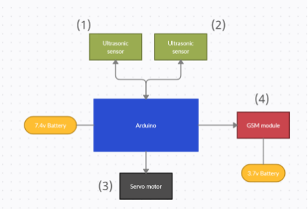
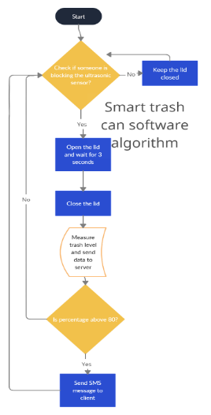
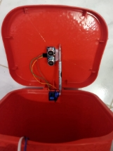
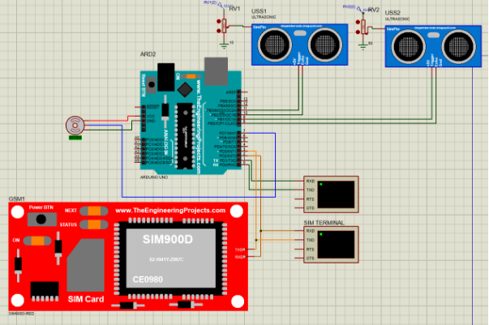
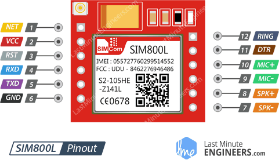
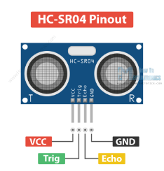
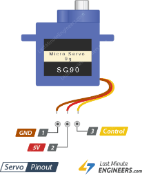

# Smart Trash Can

The Smart Trash Can project is an Internet of Things (IoT) initiative aimed at transforming waste management through advanced technology. Utilizing an Arduino-based system, this innovative trash can monitors garbage levels in real-time and sends alerts for timely collection. The project is designed to enhance efficiency in both residential and industrial settings, ensuring a cleaner and more organized environment. A key feature of this project is its integration with a mobile application, which provides users with instant access to the trash can's status and data. Rigorous testing has demonstrated the system's practicality, reliability, and cost-effectiveness, making it a viable solution for diverse applications.

## Project Features

- **Automatic Lid Opening and Closing:** The lid opens automatically when someone approaches and closes when the trash is disposed of.
- **Trash Level Monitoring:** Uses ultrasonic sensors to measure the trash level and calculate the percentage of the bin filled.
- **GSM Communication:** Sends SMS notifications and updates to the server when the bin is full.
- **Mobile Application:** Displays the status and data of the trash can.

## Table of Contents
- [Project Design and System Description](#project-design-and-system-description)
  - [Hardware](#hardware)
  - [Software](#software)
  - [Mechanical Part](#mechanical-part)
- [Project Hardware/Simulation](#project-hardware-simulation)
- [Project Specification](#project-specification)
  - [Project Parts](#project-parts)
  - [Arduino UNO](#arduino-uno)
  - [SIM800L](#sim800l)
  - [Ultrasonic Sensor (HC-SR04)](#ultrasonic-sensor-hc-sr04)
  - [Servo Motor (SG90)](#servo-motor-sg90)
  - [Trash Bin](#trash-bin)

## Project Design and System Description

### Hardware

The trash bin circuit consists of four main parts as shown in Figure 6-1:

1. **Proximity Detection:** Determines if someone is approaching the trash bin using electromagnetic radiation.
2. **Trash Level Measurement:** Uses sound waves to measure the trash level by measuring the empty vertical space in the can. By knowing the depth of the can, we use Eq. 6-1 to calculate the trash level.

   Trash level percentage = (depth - empty vertical space) / depth * 100

3. **Lid Control:** Responsible for opening and closing the lid by applying an electrical pulse of proper width to make it move to the opening angle.
4. **GSM Communication:** Responsible for telecommunicating with the network to send SMSs and send new stats to the server.

### Software

The software side consists of firmware on the Arduino and a mobile application to illustrate the trash can states and data. Source code can be found here: [GitHub Repository](https://github.com/ZiadMontaser/SmartTrashCan)

### Mechanical Part

As shown in Figure 6-3, to open the lid, we used a servo motor with enough torque to push the lid from inside. The lid closes by setting the servo motor to its original position and letting the lid fall by the effect of gravity.

## Project Hardware/Simulation

**Note:** We were only able to simulate the automatic opening part as the communication part requires physical hardware.

## Project Specification

### Project Parts

This project consists of:

- Arduino Uno or Nano
- 2x Ultrasonic Sensor
- Servo motor
- GSM module
- 3x Li-ion Battery 3.7v (more than 1500 mAh)
- Battery holder for one battery
- Battery holder for two batteries
- Wires
- Trash bin

### Arduino UNO

| Microcontroller | [ATmega328P](http://ww1.microchip.com/downloads/en/DeviceDoc/ATmega48A-PA-88A-PA-168A-PA-328-P-DS-DS40002061A.pdf) |
| :- | :- |
| Operating Voltage | 5V |
| Input Voltage (recommended) | 7-12V |
| Input Voltage (limit) | 6-20V |
| Digital I/O Pins | 14 (of which 6 provide PWM output) |
| PWM Digital I/O Pins | 6 |
| Analog Input Pins | 6 |
| DC Current per I/O Pin | 20 mA |
| DC Current for 3.3V Pin | 50 mA |
| Flash Memory | 32 KB (ATmega328P) of which 0.5 KB used by bootloader |

### SIM800L

In this project, we used SIM800L which requires a voltage between 3.4v and 4.7v in addition to 2A while connecting to the network. Otherwise, the module fails to make a connection. From experimenting, we found that the model of Arduino we were using wasn’t able to provide enough power to the GSM module. Therefore, we found that an optimal solution is to have an external battery to provide the GSM module with needed power.

| **Power Supply** | **3.4v - 4.7vDC** |
| :-: | :-: |
| **Current Required** | **1A – 2.6A** |
| **Band Frequency** | **Quad-band** |
| **Default baud rate** | **9600bps** |
| **SIM interface** | **1.3v, 3v** |
| **Timing functions** | **AT commands set** |

### Ultrasonic Sensor (HC-SR04)

| **Working Voltage** | DC 5 V |
| :-: | :-: |
| **Max Range** | 400cm |
| **Min Range** | 2cm |

### Servo Motor (SG90)

| **Voltage** | 4.8v to 6v |
| :-: | :-: |
| **Torque** | 2.5 cm/kg |
| **Speed** | 0.1 sec |

### Trash Bin

Any size can be used; however, the one we used was 8 liters.

